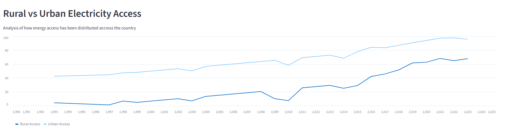
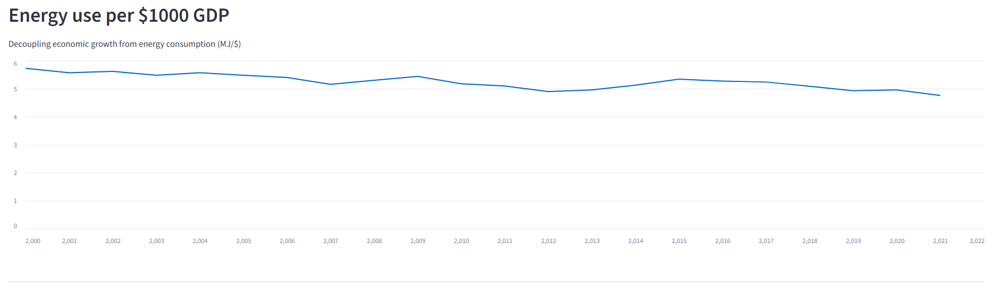
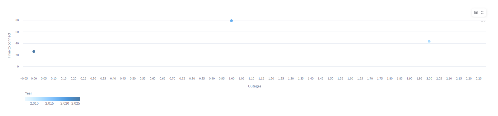

# Pydata-Capstone-Project
End module

# Energy Indicators from 90s-2000s

# The Kenyan Energy Evolution: An analytical dashboard 

## Project Overview

This project explores the evolution of Kenya energy, analyzing how electrification access, consumption patterns and energy efficiency correlate with broader economics and private sector stability.

## Key Features

The Dashboard is structured into 4 interactive sections:

    1. **Social Equality** Visualizes the disparity btween urban and rural areas to electricity. 
    2. **Economic efficiency** Visualizes and analyzes whether Kenya is decoupling economic growth from energy consumption 
    3. **Business Tax:** Uses a scatter plot analysis of how power outages and connections delay business operations 
    4. **My Recommendations** Actionable insights for government and private sectors stakeholderst to improve the grid and efficiency 

## Technologies used

    + **Processing Data:** Python , Pandas
    + **Visualizing the data:** Streamlit(`st.line_chart`, `st.scatter_chart`)
    + **Deployment:** Steamlit Cloud
    + **Environment used:** Vs code

## Prerequisites

To run this project locally, ensure you have Python installed, then install the following dependencies:

```bash
pip install streamlit pandas 
``` 

**i have included `matplotlib` incase you want to run it in a notebook to test or add things**


How to run this project 

1. clone this repository: 

```bash 
git clone https://github.com/edwintheuri/pydata-capstone-project/tree/main
```

2. Navigate to the project directory:

```bash
cd [your cloned project folder]
```

eg cd C:\Users\username\Documents\pydata-capstone-project

3. Run the application 

```bash
streamlit run app.py
```

## Insights & Impacts
This project highlighs the Reliability paradox even when electricity acces has significatly expanded through the country, power quality still remains one of those bottlenecks for the private sector growth. In my analysis , there is profound suggestion that incentivizing decentralized solar for smes and grid-optimizations is the most efficient path forward to Kenyan's energy future

## Acknowledgements

Data is sourced from the **World Bank Energy and Mining**  open dataset

## Dashboard preview 

| Social Equality | Economic Efficiency | Business Tax | 
| :--: | :--: | :--:|
|  |  | |